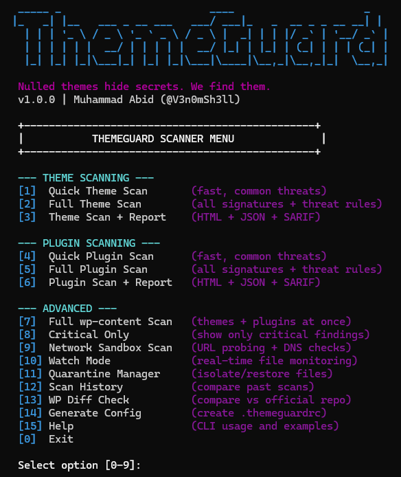

<p align="center">
  
</p>

<p align="center">
  <b>Enterprise WordPress Threat Detection Engine</b><br>
  <sub>30 Modules • 158 Signatures • ML Classification • Real-Time Protection • Cross-File Correlation</sub>
</p>

<p align="center">
  
  
  
  
  
</p>

---

## ⚡ What is ThemeGuard?

ThemeGuard is a **WordPress-focused** static and behavioral malware scanner with recursive payload decoding, confidence scoring, cross-file correlation, cloud threat intelligence, and real-time watch mode.

Unlike generic security tools, ThemeGuard understands **WordPress internals** - hooks, cron persistence, REST API backdoors, nonce bypasses, option table poisoning, and more.

---

## 🔥 Key Features

<table>
<tr>
<td width="50%">

### 🔍 Detection Engine
- **158 detection signatures** across 7 categories
- **30 custom `.tgr` threat rules** (WordPress-specific)
- **Aho-Corasick O(n)** multi-pattern matching
- **Recursive payload decoder** (8-depth: b64→hex→chr→rot13→gzinflate)
- **ML classifier** - 26-feature statistical risk scoring

</td>
<td width="50%">

### 🛡️ WordPress Deep Analysis
- **Hook backdoor** detection (`add_action`/`add_filter`)
- **Cron persistence** detector
- **REST API** unauthenticated endpoint scanner
- **Nonce/auth bypass** detection
- **WP Core integrity** check (WordPress.org API)

</td>
</tr>
<tr>
<td>

### 🧠 Intelligence Layer
- **Cross-file correlation** - shared URLs, domains, campaigns
- **Malware family classification** (WP-VCD, WSO, AnonymousFox, etc.)
- **Cloud threat intel** - URLhaus + WPScan API integration
- **C2/phone-home** communication detection
- **Infection timeline** analysis

</td>
<td>

### ⚙️ Enterprise Features
- **Confidence scoring** (separate from severity)
- **Finding deduplication** with stable IDs
- **False positive suppression** engine
- **SQLite evidence store** with scan diff
- **Triage reports** with actionable priorities
- **Real-time watch mode** with debounce

</td>
</tr>
</table>

---

## 📊 Detection Coverage

| Category | Signatures | Examples |
|----------|:----------:|---------|
| 🔴 PHP Backdoors | 48 | eval/base64 chains, command injection, RCE, file write |
| 🟠 Webshells | 23 | c99, r57, WSO, Alfa, b374k, China Chopper, reverse shells |
| 🟡 Plugin Backdoors | 30 | AJAX exploits, REST API, license bypass, cron persistence |
| 🔵 Crypto Miners | 13 | CoinHive, XMRig, CryptoLoot, mining pool URLs |
| 🟣 SEO Spam | 13 | Hidden links, pharma hacks, doorway pages, cloaking |
| ⚪ Obfuscation | 16 | str_rot13, hex2bin, chr chains, strrev, error suppression |
| 🟤 File Anomalies | 15 | Double extensions, WP-VCD, .htaccess abuse, nulled markers |

---

## 🏗️ Architecture

```
┌──────────────────────────────────────────────────────┐
│                   SCAN PIPELINE                      │
├──────────────────────────────────────────────────────┤
│  Phase A: Prefilter                                  │
│    file_walker → prefilter → file_classifier         │
│                                                      │
│  Phase B: Per-File Analysis (parallel)               │
│    signatures → obfuscation → network → integrity    │
│    → PHP deep → WP deep → threat engine → ML         │
│    → recursive decoder → cloud intel                 │
│                                                      │
│  Phase C: Directory Scans                            │
│    .htaccess → wp-config → polyglot → timeline       │
│                                                      │
│  Phase D: Post-Processing                            │
│    dedup → correlate → score → suppress → filter     │
│                                                      │
│  Phase E: Output                                     │
│    evidence store → triage report → HTML/JSON/SARIF  │
└──────────────────────────────────────────────────────┘
```

---

## 🚀 Installation

### 🐉 Kali Linux

```bash
# Python3 comes pre-installed on Kali
sudo apt update && sudo apt install -y python3 python3-pip git

# Clone the repository
git clone https://github.com/V3n0mSh3ll/themeguard.git
cd themeguard

# Install dependencies
pip3 install -r requirements.txt

# Make executable (optional)
chmod +x themeguard.py

# Verify installation
python3 -m unittest tests.test_scanner tests.test_enterprise -v
```

### 📱 Termux (Android)

```bash
# Initial setup
pkg update && pkg upgrade -y
pkg install -y python git

# Clone the repository
git clone https://github.com/V3n0mSh3ll/themeguard.git
cd themeguard

# Install dependencies
pip install -r requirements.txt

# Run ThemeGuard
python themeguard.py

# Scan files on device storage
# termux-setup-storage   (grant storage access first time)
python themeguard.py --path /sdcard/Download/theme-folder/
```

### 🐧 Ubuntu / Debian / Any Linux

```bash
sudo apt update && sudo apt install -y python3 python3-pip git
git clone https://github.com/V3n0mSh3ll/themeguard.git
cd themeguard
pip3 install -r requirements.txt
python3 themeguard.py
```

### 🪟 Windows

```powershell
# Requires Python 3.8+ from python.org
git clone https://github.com/V3n0mSh3ll/themeguard.git
cd themeguard
pip install -r requirements.txt
python themeguard.py
```

---

## 📖 Usage Guide

### 🎯 Interactive Menu (Easiest)

```bash
python3 themeguard.py
```

This launches the interactive menu - select an option and the scan starts:

```
╔══════════════════════════════════════════╗
║         THEMEGUARD v1.0                  ║
║   WordPress Threat Detection Engine      ║
╠══════════════════════════════════════════╣
║  [1] Scan Theme                          ║
║  [2] Scan Plugin                         ║
║  [3] Scan Full wp-content                ║
║  [4] Watch Mode (Real-time)              ║
║  [5] View Scan History                   ║
║  [6] Quarantine Management               ║
║  [0] Exit                                ║
╚══════════════════════════════════════════╝
```

### 🔍 Theme Scan

```bash
# Basic scan
python3 themeguard.py --path ~/Downloads/flavor/

# Deep scan (includes WP core integrity check)
python3 themeguard.py --path ~/Downloads/flavor/ --deep

# Show only high/critical findings
python3 themeguard.py --path ~/Downloads/flavor/ --severity high
```

### 🔌 Plugin Scan

```bash
python3 themeguard.py --path ~/Downloads/contact-form-7/ --type plugin
```

### 📂 Full wp-content Scan

```bash
# Scan everything - themes, plugins, uploads, mu-plugins
python3 themeguard.py --path ~/Downloads/wp-content/ --type full
```

### 🌐 Network Analysis (Cloud Intel)

```bash
# Check URLs and hashes against URLhaus + WPScan API
python3 themeguard.py --path ~/Downloads/flavor/ --network

# Combine deep scan with network analysis
python3 themeguard.py --path ~/Downloads/flavor/ --deep --network
```

### 📊 Generating Reports

```bash
# HTML report
python3 themeguard.py --path ~/Downloads/flavor/ --report html

# JSON report
python3 themeguard.py --path ~/Downloads/flavor/ --report json

# Both formats
python3 themeguard.py --path ~/Downloads/flavor/ --report both

# SARIF format (for CI/CD integration)
python3 themeguard.py --path ~/Downloads/flavor/ --report sarif
```

Reports are saved in the `reports/` directory.

### 👁️ Watch Mode (Real-Time Monitoring)

```bash
# Automatically scans any file changes in real time
python3 themeguard.py --path ~/Downloads/flavor/ --watch
```

Watch mode features:
- Detects file changes (new, modified, deleted)
- 3-second debounce to prevent scan flooding
- Storm protection (throttles at 50+ changes per 10 seconds)
- Auto-recovery on errors
- Press `Ctrl+C` to stop

### 🔒 Quarantine

When critical or high-severity threats are found, quarantine the infected files:

```bash
# Quarantine after scan
python3 themeguard.py --path ~/Downloads/flavor/ --quarantine

# List quarantined files
python3 themeguard.py --list-quarantine

# Restore a quarantined file (SHA-256 integrity verified)
python3 themeguard.py --restore infected-file.php
```

### 📜 Scan History

```bash
# View previous scans (stored in SQLite)
python3 themeguard.py --history

# Compare two scans (shows new vs resolved findings)
python3 themeguard.py --diff scan-id-1 scan-id-2
```

### 🧪 Running Tests

```bash
# Run all 68 tests
python3 -m unittest tests.test_scanner tests.test_enterprise -v

# Enterprise module tests only
python3 -m unittest tests.test_enterprise -v

# Core scanner tests only
python3 -m unittest tests.test_scanner -v
```

---

## ⚡ Quick Examples - Real World Scenarios

```bash
# Scenario 1: Check a downloaded theme
python3 themeguard.py --path ~/Downloads/flavor/ --deep --report html

# Scenario 2: Monitor a theme folder for changes
python3 themeguard.py --path ~/Downloads/flavor/ --watch

# Scenario 3: Quick plugin check (Termux)
python3 themeguard.py --path /sdcard/Download/flavor/ --type plugin

# Scenario 4: CI/CD pipeline integration
python3 themeguard.py --path ./flavor/ --report sarif --severity high
# Exit code 0 = clean, 1 = high, 2 = critical

# Scenario 5: Full wp-content audit with network intel
python3 themeguard.py --path ~/Downloads/wp-content/ --type full --deep --network --report both
```

---

## 📋 Scan Output

ThemeGuard produces **triage-prioritized** reports:

```
============================================================
  THEMEGUARD TRIAGE REPORT
============================================================
  Target:       ~/Downloads/flavor
  Scan time:    2.47s
  Files:        847
  Total finds:  12

  [!] IMMEDIATE ACTION REQUIRED - QUARANTINE
  ----------------------------------------
    functions.php:142
      eval(base64_decode(...)) with network callback
      Confidence: 95% | Severity: critical

  [?] MANUAL REVIEW RECOMMENDED
  ----------------------------------------
    includes/helper.php:89
      Dynamic function dispatch with user input
      Confidence: 62% | Severity: high

  CORRELATED THREATS (CAMPAIGNS)
  ----------------------------------------
    Same malicious URL in 3 files: http://evil.com/gate.php
      Files: functions.php, footer.php, admin.php

  RECOMMENDED NEXT STEPS
  ----------------------------------------
  1. Quarantine the files listed above IMMEDIATELY
  2. Check if the site has been compromised
  3. Reset all passwords and API keys
============================================================
```

---

## 🧪 Tests

```bash
# Run all tests (68 tests)
python -m unittest tests.test_scanner tests.test_enterprise -v
```

| Suite | Tests | Coverage |
|-------|:-----:|----------|
| Core Scanner | 14 | Pattern engine, obfuscation, network, integrity |
| Enterprise | 54 | Dedup, scorer, decoder, classifier, correlation, evidence store, triage |

---

## 📁 Module Map

| Module | Purpose |
|--------|---------|
| `pattern_engine.py` | Aho-Corasick + regex signature matching |
| `threat_engine.py` | Custom `.tgr` rule engine |
| `ml_classifier.py` | 26-feature statistical risk classifier |
| `decoder_recursive.py` | 8-depth recursive payload decoder |
| `correlation.py` | Cross-file campaign detection |
| `scorer.py` | Confidence scoring with signal weights |
| `deduper.py` | Finding dedup with stable IDs |
| `evidence_store.py` | SQLite scan history & diff |
| `cloud_intel.py` | URLhaus + WPScan API |
| `wp_deep_scan.py` | WordPress hook/cron/REST analysis |
| `php_deep_scan.py` | Taint flow, call graph, dead code |
| `safe_io.py` | Robust I/O, regex DoS protection |
| `watcher.py` | Real-time watch with debounce |
| `quarantine.py` | SHA-256 verified quarantine/restore |

> Full list: **30 modules** - see [`docs/architecture.md`](docs/architecture.md)

---

## 🔒 Security Properties

- ✅ No `eval()` in analysis pipeline
- ✅ Regex DoS protection (length + search limits)
- ✅ Recursive decode depth limited (8 levels)
- ✅ Decompression bomb protection
- ✅ Symlink escape + path traversal protection
- ✅ Quarantine hash verification on restore
- ✅ Tamper detection in quarantine manifest
- ✅ Atomic JSON writes (crash-safe)

---

## 📖 Documentation

| Document | Description |
|----------|-------------|
| [`architecture.md`](docs/architecture.md) | 5-phase pipeline, 30-module map, data flow |
| [`rule_format.md`](docs/rule_format.md) | `.tgr` syntax, modifiers, conditions |
| [`known_limitations.md`](docs/known_limitations.md) | Honest coverage of all gaps |

---

## 🔢 Exit Codes

| Code | Meaning |
|:----:|---------|
| `0` | Clean - no critical/high findings |
| `1` | High severity issues found |
| `2` | Critical threats detected |

---

## 👤 Author

**Muhammad Abid** (V3n0mSh3ll)
Offensive Security Researcher • AI Security • Full-Stack Developer

[](https://github.com/V3n0mSh3ll)

---

## 📄 License

MIT
